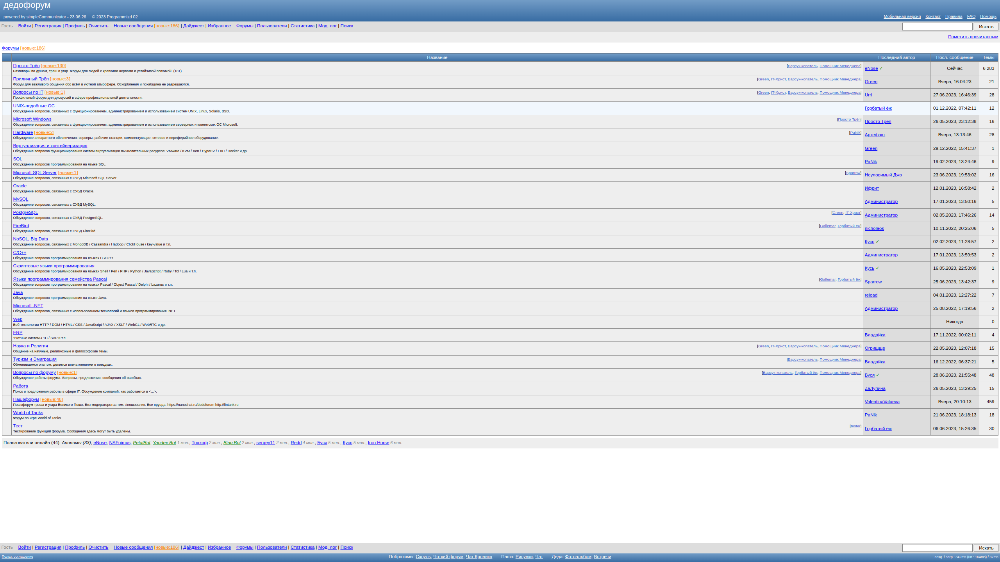
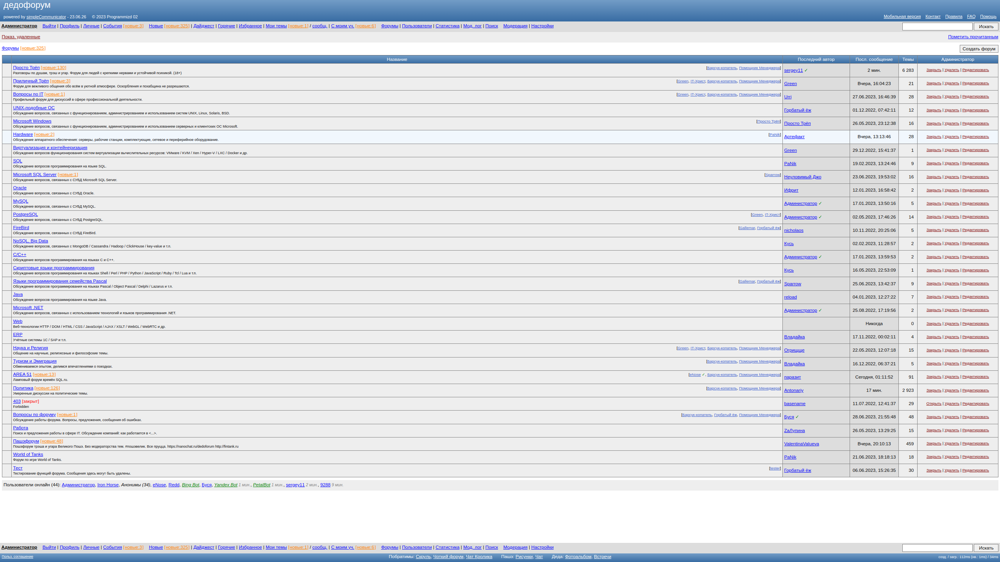
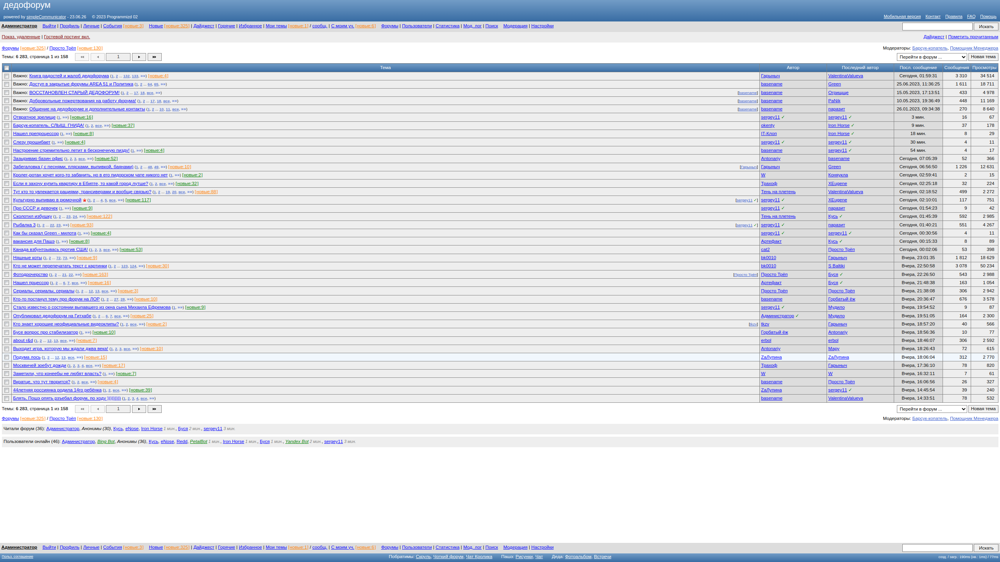

<div class="help">
<h1 style="margin-top: 0px; text-align: center">О форуме simpleCommunicator</h1>

<p><strong>Автор проекта: архитектура, разработка и программирование — <a href="https://nosql.ru/forum/view_profile.php?uid=9">Programmizd 02</a></strong>
<br>
<br>
Улучшения и кастомизация — <a href="https://chat.nosql.ru/">Кролег</a>
<br>
Тестирование, поиск уязвимостей — <a href="http://fintank.ru/game/">Пашэ</a>
<br>
Техническая поддержка — <a href="https://anton.koudinov.ru/">Антон</a>
<br>
<br>
Демонстрация работы — <a href="https://nosql.ru/forum/forums.php">Дедофорум NoSQL.ru</a>, <a href="https://resql.ru/forum/forums.php">SQL.ru | ReSQL.ru</a>
</p>

<h2>Лицензия</h2>

<p>Эта программа является свободным программным обеспечением. Вы можете распространять и/или модифицировать её согласно 
условиям Стандартной Общественной Лицензии GNU, опубликованной Фондом Свободного Программного Обеспечения, версии 3 или, 
по вашему желанию, любой более поздней версии.</p>

<p>
Эта программа распространяется в надежде, что она будет полезной, но БЕЗ ВСЯКИХ ГАРАНТИЙ, в том числе подразумеваемых 
гарантий ТОВАРНОГО СОСТОЯНИЯ ПРИ ПРОДАЖЕ и ГОДНОСТИ ДЛЯ ОПРЕДЕЛЁННОГО ПРИМЕНЕНИЯ. Смотрите Стандартную Общественную 
Лицензию GNU для получения дополнительной информации.</p>

<h2>Загрузка и установка</h2>

<p>Версия: 2.0.47<br>
Релиз: 30.06.2025</p>

<ol>
<li>Распакуйте архив и скопируйте файлы из директории <b>forum</b> в целевую директорию веб-сервера.</li>
<li>Откройте URL-адрес в браузере. Установка начнётся автоматически.</li>
<li>Выполните шаги установки.</li>
<li>Прочитайте раздел «Помощь» после установки.</li>
</ol>
 
 <p>В архиве приложены примеры конфигураций сопутствующих сервисов.</p>

<h2>Техническая информация и системные требования</h2>

<p>Форум может быть установлен практически на любом хостинге. Программное обеспечение форума предъявляет минимальные требования к конфигурации сервера и настройкам прикладного программного обеспечения.</p>

<ul>
<li>Работает на версии PHP 8.x или выше.</li>
<li>Поддерживает системы управления базами данных:
    <ul>
    <li>MySQL 8.0.x или выше;</li>
     <li>MariaDB 10.11.x или выше;</li>
    <li>Microsoft SQL Server 2005 или выше.</li>
    </ul>
</li>
<li>Работает в браузерах:
    <ul>
    <li>Internet Explorer 10.0 или выше;</li>
    <li>Firefox;</li>
    <li>Safari;</li>
    <li>Chrome;</li>
    <li>Opera.</li>
    </ul>
</li>
</ul>

Некоторые нюансы установки и работы форума (в зависимости от используемого рабочего окружения операционной системы и сопутствующих сервисов, ниже применимо к окружению ОС RHEL 8).

- Пользователь, с правами которого работает веб-сервер, например Apache, должен иметь права на запись в директории форума `jobs`, `log`, `tmp`, `user_data` и, хотя бы разово на этапе инсталляции, в файлы `include/admin_config_inc.php`, `include/config_inc.php`.

- В случае, если применяются контекстные политики SELINUX и рабочая директория форума отлична от рабочей директории веб-сервера по умолчанию, необходимо применить соответствующие контектсные политики, например:
```
semanage fcontext -a -t httpd_sys_rw_content_t "/<path to directory>/forum(/.*)?"
restorecon -Rvv /<path to directory>/forum/
```

- Если у пользователя, с правами которого осуществляется соединение с сервером баз данных, отсутствует привилегия на созданиие базы данных, необходимо предварительно создать требуемую базу данных вручную, например, следующим образом для СУБД MySQL:
```
CREATE DATABASE db_name CHARACTER SET utf8mb4 COLLATE utf8mb4_unicode_ci;
```

- Возможно понадобится доустановка пакетов, необходимых для работы основных и опциональных функций форума:
```
php, php-gd, php-mysqlnd, php-bcmath, pngquant, ffmpeg, ImageMagick, dvipng, texlive, zip
```

- Для корректной работы генерации LATEX формул может потребоваться изменить рабочее окружение для пользователя, с правами которого работает веб-сервер при вызове программы обработки LATEX в файле `include/image_utils_inc.php` (приведены изменения по сравнению с оригинальной master версией):
```
    ////$command = 'cd ' . $temp_dir . '; ' . '/usr/bin/latex' . ' ' . $hash . '.tex < /dev/null |grep ^!|grep -v Emergency > ' . $temp_dir . $hash . '.err 2> /dev/null 2>&1';
    $command = 'cd ' . $temp_dir . '; ' . 'export HOME=/home/apache; /usr/bin/latex' . ' ' . $hash . '.tex < /dev/null | grep ^! | grep -v Emergency > ' . $temp_dir . $hash . '.err > /dev/null 2>&1';
```

----


----


----



<h2>Преимущества</h2>

<p>Форум прост в реализации и удобен в использовании.</p>

<p>Поддерживаются скины, временные зоны и разные языки интерфейса, в том числе и для гостей.</p>

<p>Скины адаптируются к девайсу — десктоп или мобильное устройство.</p>

<p>Интерфейс форума интуитивно понятен и не требует изучения документации.</p>

<p>Функционал форума не перегружен, но при этом поддерживаются все основные функции, ожидаемые пользователями от форума.</p>

<p>Для осуществления многих действий используется технология отправки данных в фоновом процессе AJAX, что обеспечивает
высокую скорость и позволяет избежать ненужных обновлений страницы.</p>

<p>Ключевыми моментами удобного интерфейса являются:

<ul>
<li>Доступность и наглядность опций для выполнения необходимых команд в зависимости от контекста.</li>
<li>Быстрота выполнения команд.</li>
<li>Использование «лёгких» элементов и функций — лайтбоксы, асинхронная отправка.</li>
<li>Поддержка стандартных интуитивных команд и горячих клавиш — Ctrl + Enter,  Ctrl + ←, Ctrl + →, Escape, Tab и т.д.</li>
<li>«Умная» фокусировка, избавляющая от необходимости избыточных движений и кликов мышью.</li>
<li>«Запоминание» и автоматическое восстановление местоположений, что избавляет от необходимости повторного выполнения навигации к необходимому месту.</li>
<li>Удобный механизм перехода после отправки сообщения — на предыдущих страницах осуществляется переход к следующему после того сообщения, на которое был дан ответ, таким образом можно читать, отправлять сообщения и продолжать чтение. Если сообщение отправляется на последней странице темы, то подгружаются новые сообщения, если они есть.</li>
<li>При переходе между страницами темы неотправленное сообщение не теряется, а мигрирует на новую страницу, где можно продолжить цитировать сообщения и отвечать на них.</li>
<li>Автоповорот картинок на основе информации EXIF и сжатие до веб-оптимизированного размера.</li>
</ul>

<p>Пользователь не всегда может чётко осознать и озвучить свои критерии и пожелания, но именно вышеперечисленные нюансы создают у него положительные ощущения комфорта и удобства при работе с приложением.
</p>

<p>Поддерживаются языки интерфейса — русский, английский, немецкий и украинский. Легко добавить переводы для других языков.</p>

<p>Форум отличается высокой производительностью, благодаря тому, что количество сообщений и тем выставляются во время их создания и при отображении списков тем и сообщений нет необходимости использовать ресурсоёмкие агрегационные функции. Пересчёт количества необходим только в случае нестандартных операций, таких как удаление или перенос тем и сообщений.</p>

<p>Поддерживается распределение нагрузки путём разделения базы данных в архитектурной схеме master для записи и slave1...slaveN для чтения и поиска.</p>

<h2>Ключевые функции</h2>

<ul>
  <li>Поддержка лайков и дизлайков.</li>
  <li>Приватные сообщения и приватные групповые темы с модерированием.</li>
  <li>Лог личных событий для пользователей.</li>
  <li>Лог модераторских действий.</li>
  <li>Статистика по пользователям и форумам.</li>
  <li>Показ пользователей, гостей и ботов, читавших тему, подфорум или просто находящихся на сайте. Клик на имени бота показывает его профиль и последние посещённые им темы.</li>
  <li>Группировка тем с новыми сообщениями — по подфоруму, своих, со своим участием, тем из списка избранных.</li>
  <li>Дайджест новых сообщений.</li>
  <li>Возможность отобразить найденные сообщения в виде общей виртуальной темы или для каждой темы показать только сообщения, удовлетворяющие критериям поиска.</li>
</ul>

<h2>Гибкие общие настройки</h2>

<ul>
  <li>Включение/отключение требования одобрения учётных записей администратором.</li>
  <li>Включение/отключение отображения онлайн статуса участников и посещённых ими тем.</li>
  <li>Включение/отключение выставления оценок, можно включить только лайки, можно сделать дизлайки анонимными.</li>
  <li>Настройка различных ограничений — на размер вложений, на количество тем в сутки, на количество сообщений в минуту и т.п.</li>
  <li>Защита гостевых ников завсегдатаев от кражи путём регистрации.</li>
  <li>Защита от регистрации фейковых и спам-акаунтов через временные email-адреса.</li>
  <li>Ведение модераторского лога. Возможность настроить уровень видимости модераторского лога — только администраторам, только модераторам, всем, всем, но не показывать имена модераторов.</li>
  <li>Настраиваемый список смайлов и комбинаций символов для их вставки. Возможность категоризировать смайлы.</li>
  <li>Включение режима праздника или траура. Появляется картинка-индикатор, при клике на которую показываются либо праздничные картинки, либо фотография умершего участника.</li>
  <li>Возможность переводить форум в режим обслуживания с указанием планируемого времени завершения, а также заранее уведомлять посетителей о планируемом обслуживании с указанием планируемого времени начала и завершения.</li>
</ul>

<h2>Гибкие настройки для отдельных форумов</h2>

<ul>
<li>Поддержка закрытых форумов, с доступом только для определённых участников или только для зарегистрированных участников.</li>
<li>Поддержка закрытых форумов, защищённых паролем.</li>
<li>Возможность привязать право писать сообщения на форуме к возрасту ника (подразумевается возраст ника с момента регистрации на форуме) и количеству сообщений.</li>
<li>Возможность запретить гостей на форуме.</li>
<li>Возможность включить ограниченный режим для гостей, тогда смогут писать только гости с возрастом токена более N часов или те, чей IP-адрес в белом списке.</li>
<li>Возможность запретить или разрешить авторам редактирование собственных сообщений.</li>
<li>Возможность отметить форум как форум с более строгими особенными правилами, чтобы при написании сообщений участникам выдавалось об этом предупреждение.</li>
</ul>

<h2>Функциональные возможности для администраторов</h2>

<ul>
<li>Назначение модераторов форумов.</li>
<li>Возможность вручную активировать или одобрить учётную запись зарегистрированного пользователя.</li>
<li>Возможность удалить учётную запись зарегистрированного пользователя.</li>
<li>Возможность сделать пользователя привилегированным, на которого не будут действовать ограничения.</li>
<li>Возможность сделать пользователя привилегированным модертаором тем, на которого не будут действовать ограничения по модерированию тем.</li>
<li>Возможность запретить пользователю отправлять приватные сообщения.</li>
<li>Возможность запретить модератору форума осуществлять глобальные модераторские операции — глобальный бан, сокрытие профиля участников, запрет выставления оценок.</li>
<li>Возможность запретить модератору форума видеть IP-адреса и фингерпринты участников.</li>
<li>Возможность удалить токен (ридмаркер) гостя, если он выждал время и вышел, чтобы продолжить нарушения при включённом ограниченном режиме для гостей.</li>
<li>Возможность управлять белым списком IP-адресов, на которые не действует ограниченный режим для гостей.</li>
<li>Возможность управлять списком IP-адресов бразура TOR — заблокировать все или заблокировать или разрешить отдельные на запись или чтение.</li>
<li>Бан участника в связи со смертью или утратой ника — в таком случае запрещается вход в аккаунт, а не только написание сообщений из-под него.</li>
</ul>

<h2>Функциональные возможности для модераторов форумов</h2>

<ul>
  <li>Быстрый выбор тем для закрытия, удаления, слияния и переноса в другой форум.</li>
  <li>Быстрый выбор сообщений для удаления и переноса в другую или новую тему.</li>
  <li>Прикрепление тем и сообщений в шапку, закрытие и открытие тем.</li>
  <li>Возможность удалить все сообщения выбранного пользователя или гостя одним кликом в теме, форуме, во всех форумах, последние N в форуме.</li>
  <li>Возможность удалить аватар гостя.</li>
  <li>Возможность просматривать и восстанавливать удалённые сообщения, вложения, темы и форумы.</li>
  <li>Эффективное удаление флуда с помощью специального инструмента, дающего возможность удалить сообщения на форуме за определённый период для всех гостей или участников по возрасту учётной записи.</li>
  <li>Временные баны с автоматическим разбаном.</li>
  <li>Возможность забанить пользователей только в определённом форуме или в определённой теме.</li>
  <li>Возможность назначить пользователя модератором определённой темы в подконтрольном форуме.</li>
  <li>Возможность дать доступ пользователю и отнять доступ в подконтрольный закрытый форум.</li>
  <li>Возможность скрыть профиль пользователя (при наличии разрешения на глобальные модераторские операции).</li>
  <li>Возможность запретить пользователю выставлять оценки (при наличии разрешения на глобальные модераторские операции).</li>
  <li>Возможность пакетно удалять оценки пользователя в подконтрольном форуме.</li>
  <li>Блокировка IP-адресов и фингерпринтов, в том числе и временная, с автоматическим разбаном (при наличии разрешения видеть IP-адреса).</li>
</ul>

<h2>Функциональные возможности для модераторов тем</h2>

<ul>
  <li>Быстрый выбор сообщений для удаления и переноса в другую или новую тему.</li>
  <li>Прикрепление сообщений в шапку.</li>
  <li>Возможность удалить все сообщения выбранного пользователя или гостя одним кликом в теме.</li>
  <li>Возможность просматривать и восстанавливать удалённые сообщения и вложения.</li>
  <li>Возможность забанить пользователей только в теме.</li>
  <li>Возможность запретить и разрешить гостей в теме.</li>
</ul>

<h2>Функциональные возможности для пользователей</h2>

<ul>
<li>Избранные темы и сообщения.</li> 
<li>Возможность создавать собственные теги и помечать ими сообщения, чтобы потом эффективно находить эти сообщения через поиск по тегам.</li>
<li>Прикрепление тем только для себя.</li>
<li>Редактирование собственных сообщений в течении N минут — как для зарегистрированных участников, так и для анонимных участников в пределах текущей сессии.</li> 
<li>Возможность переголосовать в течении N минут.</li> 
<li>Галерея вложений для повторного использования. Возможность пометить вложения как фавориты, которые будут всегда наверху для быстрого выбора.</li>
<li>Игнор-лист пользователей, игнор сообщений анонимных пользователей (всех или отдельных, чёрный или белый список) и игнор неинтересных тем (для них не сообщается о появлении новых сообщений). При игноре участников скрываются даже их цитаты в сообщениях других неигнорируемых пользователей. Два режима игнора — сильный и слабый. При сильном игноре сообщения и темы исключаются полностью из выдачи, при слабом игноре текст сообщений просто скрыт, но можно показать его.</li>
<li>Предпочитаемые форумы (чтобы отображались темы с новыми сообщениями только из данных форумов).</li>
<li>Профильные темы с разделением сообщений на тематические и комментарии. Возможность включить показ только тематических сообщений.</li>
<li>Возможность пометить сообщения 18+, если они содержат картинки или видеоклипы сексуального и/или шокирующего содержания. В таких сообщениях картинки приглушены, а видеоклипы свёрнуты и читатель может решить, показать картинку или нет.</li>

<li>Широкие возможности для подписки:
  <ul>
  <li>Подписка на новые сообщения в теме.</li>
  <li>Подписка на цитирование и ответы на свои посты.</li>
  <li>Подписка на цитирование и ответы на любой чужой пост, ответы на который интересуют.</li>
  <li>Подписка на новые сообщения пользователя или гостя.</li>
  <li>Подписка на упоминание слов с учётом морфологии.</li>
  <li>Подписка на уведомления о новых зарегистрированных пользователях.</li>
  </ul>
</li>

<li>Поддержка приватных сообщений. Приватные сообщения реализованы в виде приватных тем в специальном форуме. Участники приватной темы могут вести общение как в обычной форумной теме и могут покинуть приватную тему, в том числе и автор темы.</li> 
<li>Создание приватных тем с собственным модераторством. В таких темах автор может добавлять и удалять участников, удалять и редактировать сообщения. Приглашённые участники могут покинуть такую тему, в то время как сам автор не может. Однако он может удалить её (и при необходимости восстановить). При удалении доступ в тему для приглашённых участников пропадает.</li>
<li>Поддержка персональных обращений к участнику для привлечения его внимания к своему сообщению.</li> 
<li>Создание тем опросов. Поддерживаются открытые опросы, где можно увидеть, как проголосовал каждый участник, а также опросы с отложенной публикацией, когда результаты становятся видны только после публикации.</li>
<li>Создание тем с отложенной публикацией. Пока такая тема не опубликована, она видна только автору. Он может спокойно подготовить её, редактирвоать и удалять сообщения, и потом опубликовать её. Полезная функция для тем-отчетов о поездках и т.п.</li>
<li>Отображение тем с новыми сообщениями в виртуальном форуме «Темы с новыми сообщениями». Прямой переход к первому новому сообщению в теме. Детальный показ количества новых сообщений в темах и количества тем с новыми сообщениями в форумах. Цветовая дифференциация тем: уже посещённые ранее темы с новыми сообщениями и ни разу не посещённые темы с новыми сообщениями.</li>
<li>Дайджест новых сообщений — виртуальная тема из новых сообщений, максимально 5 из каждой темы с новыми сообщениями — удобная альтернатива классическому подходу к чтению новых сообщений путём входа в каждую тему с новыми сообщениями.</li>
<li>Возможность просматривать свои удалённые сообщения и вложения.</li>
<li>Уведомление и отображение событий для пользователей — о выставленных лайках, удалённых или перенесённых сообщениях, предупреждениях и блокировках модератором и т.п. Фильтрация событий. Маркер отработанных и неотработанных событий.</li>
<li>Автоматическое уменьшение ширины и высоты картинок до размера экрана и функция просмотра крупным планом. Обработка картинки перед загрузкой — попытка сжать до допустимых размеров и повернуть на нужный угол, если угол неправильный. </li>
<li>Защита пользователей от слишком длинных сообщений. Длинное сообщение автоматически обрезается и появляется кнопка для разворачивания.</li>
<li>Преобразование звуковых файлов в формат mp3, поддерживаемый встроенным аудиоплеером браузеров.</li>
<li>Включение встроенного видеоплеера браузера для видео-файлов в формате mp4.</li>
<li>Вставка внешних видео в виде статических картинок с возможностью проиграть видео либо прямо на странице, либо перейти на страинцу видеохостинга. Данное решение избавляет от задержек загрузки страницы из-за вставленных активных объектов, при этом функциональность не страдает.</li> 
<li>Вставка анимированных gif и webp картинок без немедленной загрузки. Из анимированной картинки извлекается первый фрейм, на нем рисуется кнопка запуска. Загрузка и анимация начинается только при нажатии на неё. Данное решение избавляет от задержек загрузки и подвисания браузера из-за вставленных массивных анимированных картинок.</li>
</ul>

<h2>Гибкие настройки для пользователей</h2>

<ul>
    <li>Возможность загрузить аватар и фотографию.</li>        
    <li>Возможность отключить показ картинок в сообщениях. В таком случае в сообщении показывается просто иконка, при клике на которую картинка открывается крупным планом.</li>
    <li>Возможность загрузить собственные смайлы и вставлять их в сообщения наряду с системными смайлами.</li>        
    <li>Возможность отключить развёртывание видеоклипов. В таком случае показывается только название и конпка запуска.</li>
    <li>Возможность отключить уведомления по электронной почте.</li>        
    <li>Возможность отключить события.</li>        
    <li>Возможность отключить приватные сообщения.</li>        
    <li>Возможность отключить персональные обращения.</li>        
    <li>Возможность отключить потдверждения операций.</li>        
    <li>Возможность отключить приглушение контента 18+ по умолчанию.</li>        
    <li>Выбор языка интерфейса, скина и временной зоны.</li>        
    <li>Возможность подгрузить свой CSS для адаптации выбранного скина.</li>        
    <li>Возможность заблокировать свой профиль на выбранное время.</li>        
    <li>Возможность отключить показ индивидуальной информации всех участников или отдельных участников в сообщениях — аватара, автоподписи, статусного сообщения, поля «откуда».</li>        
</ul>

<h2>Гибкие настройки для гостей</h2>

<p>Широкий функционал для гостей, поддерживаетcя большинство опций зарегистрированных пользователей.</p>

<ul>
    <li>Возможность загрузить аватар.</li>        
    <li>Возможность отключить показ картинок в сообщениях. В таком случае в сообщении показывается просто иконка, при клике на которую картинка открывается крупным планом.</li>
    <li>Возможность отключить развёртывание видеоклипов. В таком случае показывается только название и конпка запуска.</li>
    <li>Возможность отключить потдверждения операций.</li>        
    <li>Возможность отключить приглушение контента 18+ по умолчанию.</li>        
    <li>Выбор языка интерфейса, скина и временной зоны.</li>        
    <li>Возможность подгрузить свой CSS для адаптации выбранного скина.</li>        
    <li>Возможность отключить показ индивидуальной информации всех участников или отдельных участников в сообщениях — аватара, автоподписи, статусного сообщения, поля «откуда».</li>        
    <li>Экспорт/импорт настроек для синхронизации между разными компьютерами и девайсами.</li>        
    <li>Избранные темы и сообщения.</li> 
    <li>Прикрепление тем только для себя.</li>
</ul>


<h2>Статистика по пользователям</h2>

<ul>
     <li>Показ различной статистической информации в профиле пользователя — дата регистрации, последняя активность, количество сообщений, лайков, дизлайков, среднее количество сообщений и просмотров в день по итогам недели, время онлайн в день и общее время онлайн.</li>        
     <li>Контекстные опции для поиска последних сообщений, тем, вложений пользователя, а также модерируемых и игнорируемых им тем.</li>        
     <li>Контекстные опции для просмотра модераторского лога и модерирования пользователя.</li>        
     <li>Показ недавних прочитанных тем.</li>        
     <li>Активность (просмотры и сообщения) пользователя за определённый период.</li>        
     <li>Активность (просмотры и сообщения) пользователя по часам по временной зоне просматриваемого пользователя, либо просматривающего пользователя.</li>        
     <li>Информация об игноре и скрытии профиля — кто игнорирует пользователя, кого игнорирует пользователь, кто скрывает его профиль, чей профиль скрывает он.</li>        
     <li>Просмотр статистики оценок — кто лайкал/дизлайкал автора, кого лайкал/дизлайкал автор, сообщения пользователя с лайками/дизлайками других пользователей, сообщения пользователей с лайками/дизлайками данного пользователя, сообщения данного пользователя с лайками/дизлайками других пользователей. Клик на оценки вызывает подборку сообщений с данными оценками.</li>        
     <li>Аналитика для модераторов по IP-адресам для выявления клонов. Показ списка IP-адресов, под которыми оставлял сообщения данный участник. Показ участников, оставлявших сообщения под данным IP-адресом. Показ участников, оставлявших сообщения под теми же IP-адресами, под которыми оставлял сообщения данный участник.</li>
</ul>

<h2>Статистика по гостям</h2>

<ul>
     <li>Последняя активность.</li>        
     <li>Контекстные опции для поиска последних сообщений, тем, вложений пользователя, а также модерируемых и игнорируемых им тем.</li>        
     <li>Контекстные опции для просмотра модераторского лога и модерирования пользователя.</li>        
     <li>Показ недавних прочитанных тем.</li>        
     <li>Аналитика для модераторов по IP-адресам для выявления клонов. Показ списка IP-адресов, под которыми оставлял сообщения данный участник. Показ участников, оставлявших сообщения под данным IP-адресом. Показ участников, оставлявших сообщения под теми же IP-адресами, под которыми оставлял сообщения данный участник.</li>
</ul>

<h2>Статистика по ботам</h2>

<ul>
     <li>Последняя активность.</li>
     <li>Показ недавно прочитанных тем.</li>
</ul>

<h2>Статистика по форумам</h2>

<p>Показ статистической информации за выбранный период времени и за последние 24 часа и предыдущие 24 часа:</p>

<ul>
  <li>Новые зарегистрированные пользователи.</li> 
  <li>Количество пользователей, посетивших форум (бывших онлайн).</li> 
  <li>Количество написанных сообщений.</li> 
  <li>Количество созданных тем.</li> 
  <li>Количество просмотров.</li> 
  <li>Среднее количество сообщений в день.</li> 
  <li>Количество поставленных оценок. Клик на оценки вызывает подборку сообщений с данными оценками.</li> 
  <li>Активность (просмотры и сообщения).</li>        
  <li>География посещений и текущей активности.</li> 
  <li>Статистика по браузерам, операционным системам и ботам. Клик на имени бота показывает его профиль и последние посещённые им темы.</li> 
</ul>

<h2>Мощный и гибкий поиск</h2>

<ul>
  <li>Поиск пользователей. Сортировка пользователей по рейтингу, количеству сообщений и активности.</li> 
  <li>Поиск сообщений с вложением, с картинками, с аудио и видео, со ссылками, с примерами программного кода, с содержимым 18+.</li> 
  <li>Поиск в избранных темах и сообщениях.</li>
  <li>Поиск в личных сообщениях.</li> 
  <li>Поиск в определённой теме.</li> 
  <li>Возможность отфильтрованного отображения только сообщений, удовлетворяющих критериям поиска, в пределах многостраничной темы — только сообщения автора темы, только свои сообщения в теме, только картинки, только видео, только тематические.</li> 
  <li>Возможность отобразить найденные сообщения в виде общей виртуальной темы или для каждой темы показать только сообщения, удовлетворяющие критериям поиска.</li>
  <li>Поиск по тегам. Пользователь может создавать теги и помечать ими сообщения.</li> 
  <li>Поиск в удалённых темах и удалённых сообщениях (для модераторов).</li> 
</ul>

</div>

